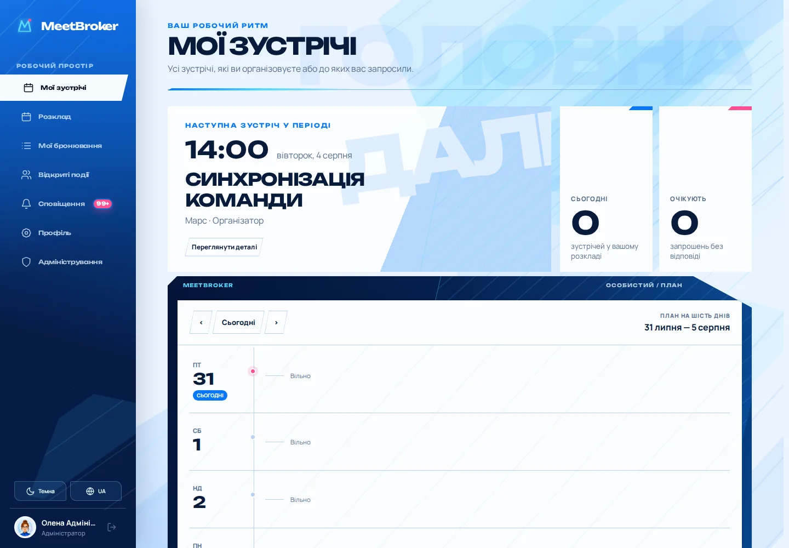
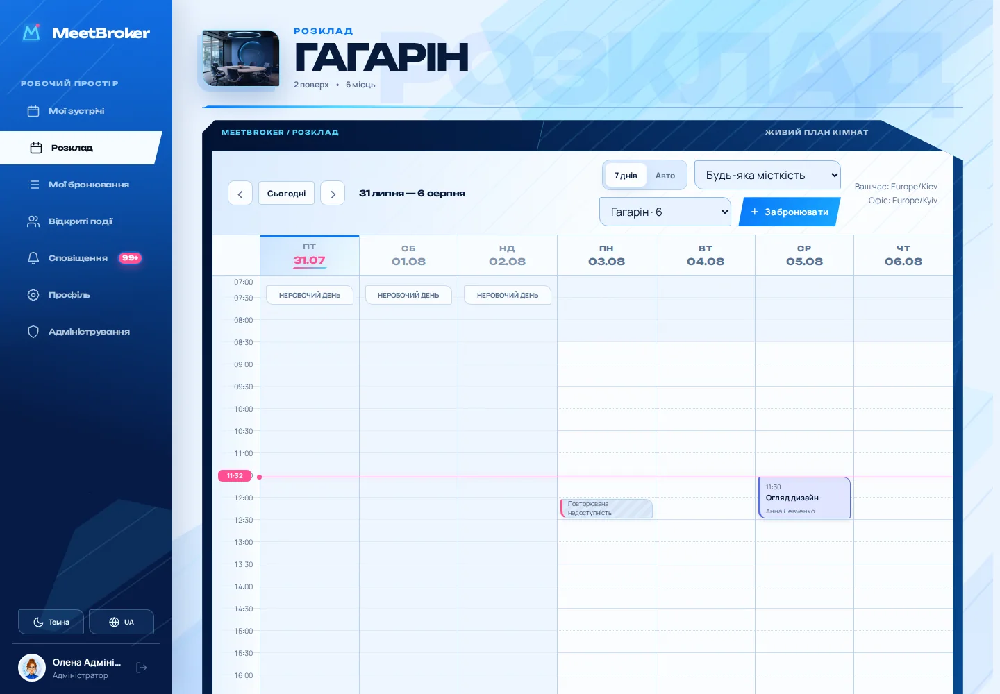
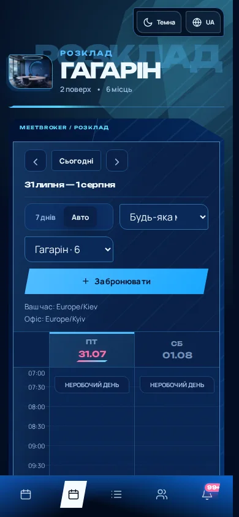
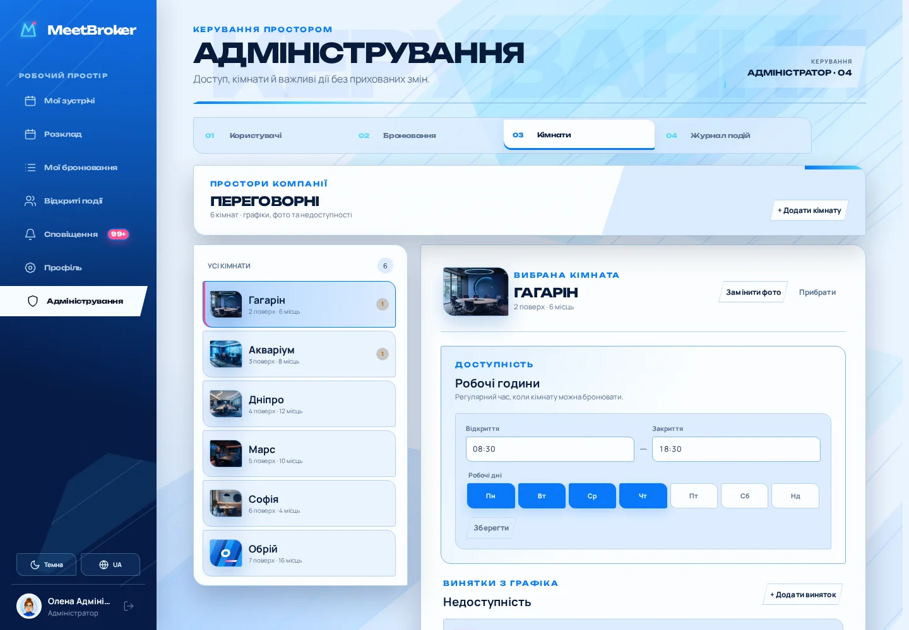

# MeetBroker

## Технічний опис системи

**Версія документа:** 1.0  
**Стан продукту:** конкурсне MVP, готове до наскрізного тестування  
**Дата:** 31 липня 2026 року

MeetBroker — корпоративна система планування кімнатних та онлайн-зустрічей.
Вона поєднує точний календар переговорних, персональну agenda, запрошення,
відкриті події, профілі, сповіщення й окремий адміністративний контур.

Документ описує фактичну реалізацію репозиторію. Ранні дизайн-концепти та
історичні припущення не використовуються як джерело технічної істини.



## 1. Архітектурні цілі

Система побудована навколо кількох інваріантів:

- бронювання не можуть перетинатися в межах однієї кімнати;
- організатор або учасник не може одночасно перебувати у двох зустрічах;
- правила доступу перевіряються сервером, а не лише приховуються в UI;
- зовнішня доставка сповіщень не блокує транзакцію бронювання;
- час зберігається як UTC-момент, а показується в IANA-поясі користувача;
- DEMO і PRODUCTION відрізняються явною інсталяційною політикою;
- інтерфейс адаптивний, локалізований і доступний з клавіатури.

## 2. Контейнерна топологія

```text
Browser
  |
  v
Nginx :8080
  |-- /             -> React web :4173
  |-- /api/*        -> NestJS API :3000
  `-- /uploads/*    -> NestJS media endpoint

NestJS API ---------> PostgreSQL 17
Notification worker -> PostgreSQL 17
Notification worker -> SMTP / Telegram Bot API
```

| Компонент | Технологія | Відповідальність |
|---|---|---|
| `nginx` | Nginx 1.27 Alpine | Єдина зовнішня точка, reverse proxy, базові security headers |
| `web` | React 19, TypeScript, Vite | SPA, календар, форми, адміністративний UI |
| `api` | NestJS 11, Node.js 24 | HTTP API, правила предметної області, транзакції |
| `worker` | Той самий API image | Outbox, повторні спроби, email і Telegram |
| `postgres` | PostgreSQL 17 | Дані, інваріанти, аудит, черга outbox |

API та worker не збирають два різні application images. Вони запускають
різні entry points одного образу. У single-instance Compose API застосовує
міграції та опційний demo seed до старту NestJS; worker очікує його health
check. У multi-replica production міграції мають бути окремим deployment
job на тому самому image.

## 3. Frontend

### Технологічний шар

- React 19 і TypeScript;
- Vite для production build та route chunks;
- TanStack Query для server state, інвалідації та pending/error станів;
- `date-fns` і `date-fns-tz` для календарних операцій;
- власний lightweight routing без зайвого framework overhead;
- модульні CSS-файли, semantic tokens і спільні UI-компоненти.

### Основні екрани

1. **Мої зустрічі** — кімнатні та онлайн-події організатора й учасника.
2. **Розклад** — семиденний або Auto-календар вибраної кімнати.
3. **Мої бронювання** — майбутні/минулі записи та онлайн-зустрічі.
4. **Відкриті події** — приєднання до доступних усій компанії зустрічей.
5. **Сповіщення** — пагінований центр, unread badge і явні переходи.
6. **Профіль** — аватар, timezone, email, пароль і notification matrix.
7. **Адміністрування** — користувачі, бронювання, кімнати й журнал подій.

Основні сторінки завантажуються окремими route chunks. Початковий bundle не
включає наперед календар, профіль і важку адміністративну частину.

### Стан і помилки

API повертає стабільний `code` та параметри. Frontend перетворює їх на
локалізоване повідомлення і не показує користувачу сирий server message.
Data-driven екрани мають окремі loading, empty, error, permission, conflict
і success стани.



## 4. Backend і предметні модулі

NestJS API розділено на предметні модулі:

| Модуль | Основна відповідальність |
|---|---|
| `auth` | Реєстрація, login/logout, email token, cookie sessions |
| `users` | Профіль, avatar upload, email і пароль, каталог колег |
| `rooms` | Доступний користувачу каталог переговорних |
| `bookings` | Розклад, кімнатні/онлайн зустрічі, recurrence, учасники |
| `notifications` | Центр, preferences, channels, Telegram linking, worker |
| `access-policies` | Capability-обмеження з початком і завершенням |
| `admin` | Користувачі, бронювання, кімнати, недоступність, аудит |
| `database` | Pool, транзакції, міграції, seed і operator CLI |

DTO перевіряються через `class-validator`. SQL-запити параметризовані.
Notification runtime є першим повністю переведеним на Drizzle ORM модулем;
інші стабільні предметні запити залишаються на типізованому `pg` і
переносяться інкрементально.

## 5. Модель даних

### Облікові записи й доступ

- `users` — профіль, роль, locale, theme, timezone, verification/approval;
- `sessions` — hash opaque token, строк дії та відкликання;
- `email_verification_tokens` — одноразові hash-токени на 24 години;
- `user_restrictions` — capability, причина, плановий початок і завершення;
- `audit_logs` — актор, дія, ціль, деталі й timestamp.

### Кімнати й зустрічі

- `rooms` — назва, поверх, місткість, фото, години та робочі дні;
- `room_blocks` і `room_block_series` — разова/повторювана недоступність;
- `bookings` і `booking_series` — окремі зустрічі та recurrence metadata;
- `booking_participants` — запрошення й відповіді учасників.

### Сповіщення

- `notifications` — внутрішній центр користувача;
- `notification_preferences` — дані підключених каналів;
- `notification_subscriptions` — матриця `категорія × канал`;
- `notification_outbox` — надійна черга зовнішньої доставки;
- `telegram_connections` і `telegram_link_tokens` — bot binding flow.

Міграціями керує тільки `node-pg-migrate`. Drizzle використовується для
runtime-запитів і не є другим migration engine.

## 6. Правила бронювання

### Час

- API приймає ISO 8601;
- PostgreSQL зберігає моменти як `timestamptz`;
- інтерфейс показує час у timezone профілю або браузера;
- офісні правила обчислюються в `Europe/Kyiv`;
- інтервали є напіввідкритими: `[start, end)`;
- початок і завершення вирівняні до 30-хвилинної сітки.

### Конкурентність

Створення проходить кілька рівнів захисту:

1. предметна валідація API;
2. транзакція та PostgreSQL advisory lock на кімнату;
3. повторна перевірка конфлікту всередині транзакції;
4. `EXCLUDE USING gist` для активних інтервалів кімнати.

Якщо два запити одночасно претендують на один слот, один завершується
успішно, інший отримує контрольований `409 SLOT_TAKEN`.

### Особиста зайнятість

Для організатора й кожного учасника перевіряються всі кімнатні та онлайн
зустрічі. Конфлікт повертає придатний для пояснення список: користувач,
назва зустрічі та час накладки.

### Доступність кімнати

Кімната має:

- робочі години;
- набір робочих днів;
- разові блокування;
- серії кожні N днів або у вибрані дні тижня.

Звичайний користувач не може бронювати закритий період. Адміністратор може
виконати override лише з явною причиною; дія записується до аудиту.

## 7. Повторення й редагування

Система підтримує щоденні та щотижневі серії. Кожне occurrence є звичайним
бронюванням із посиланням на `booking_series`, тому:

- календар читає один уніфікований набір подій;
- одну подію можна змінити без переписування сусідів;
- можна скасувати occurrence або вибрану й усі наступні;
- створення серії є атомарним;
- notification pipeline бачить реальні зміни кожного одержувача.

## 8. Сповіщення

```text
Domain transaction
  |-- booking / participant / access changes
  `-- notification_outbox row
                 |
                 v
          Notification worker
          |-- IN_APP
          |-- EMAIL
          `-- TELEGRAM
```

`NotificationChannel` є абстрактним контрактом. Registry підключає
незалежні email і Telegram adapters. Користувач вибирає канали окремо для
груп `INVITATIONS`, `CHANGES`, `REMINDERS` і `ACCESS`.

Outbox має унікальний event key, статуси, retry metadata та атомарне
claiming. Повторний цикл worker не створює дублікати. Збій SMTP або Telegram
не відкочує бронювання.

### Email

- Nodemailer через SMTP;
- STARTTLS або implicit TLS;
- multipart text + адаптивний брендований HTML;
- екранування динамічного тексту;
- dev-log fallback лише поза production;
- verification messages можуть примусово використовувати email незалежно
  від звичайної notification matrix.

### Telegram

- одноразовий link token на 10 хвилин;
- `tg://` deep link, `t.me` fallback і копіювання посилання;
- `POLLING` для локального demo;
- `WEBHOOK` для HTTPS production;
- `DISABLED` для інсталяцій без Telegram.

## 9. Автентифікація й безпека

- паролі хешуються Argon2;
- session token генерується криптографічно випадково й у БД зберігається
  тільки його hash;
- cookie має `HttpOnly`, `SameSite=Lax`, configurable `Secure`, строк дії та
  фіксований path;
- зміна пароля вимагає поточний пароль і відкликає інші активні сесії;
- зміна email може вимагати одноразове підтвердження;
- public, approved та admin routes відділені guard metadata;
- відкликаний доступ і активні capability-обмеження перевіряються на кожному
  захищеному запиті;
- роль адміністратора змінюється лише operator CLI;
- останнього активного адміністратора захищено від випадкового demote/revoke;
- Nginx додає `nosniff`, `DENY` для frame та strict referrer policy;
- uploads перевіряються декодером Sharp, обмежуються за pixels, обрізаються
  та перекодовуються у WebP.

У production TLS завершується на зовнішньому ingress/reverse proxy, а
`SESSION_COOKIE_SECURE` має бути увімкнено.

## 10. DEMO і PRODUCTION

| Політика | DEMO | PRODUCTION |
|---|---|---|
| Новий профіль | Одразу схвалений | Очікує адміністратора |
| Demo seed | Дозволений через `SEED_DEMO_DATA=true` | Має бути вимкнений |
| Email verification | Може бути вимкнена | Рекомендовано увімкнути |
| Demo credentials | Доступні | Заборонені |
| Telegram updates | Зручно `POLLING` | `WEBHOOK` або `DISABLED` |

`APP_MODE` і `SEED_DEMO_DATA` є різними параметрами. Production mode не
повинен випадково створювати показові облікові записи.

## 11. Медіа, локалізація й теми

Avatar і booking cover lifecycle винесені в окремі сервіси. На старті
застосовується persistent local volume, а БД зберігає відносний шлях.
Предметна робота із зображеннями вже ізольована, але повноцінного
`StorageAdapter` контракту ще немає; перехід на S3 потребуватиме виділення
цього інтерфейсу в окремому інкременті.

Підтримуються `uk`, `en`, `de`, `es`, `fr`, `ja`. UI й notification
templates мають окремі типізовані каталоги. Тема `SYSTEM`, `LIGHT` або
`DARK` зберігається в профілі та використовує спільні semantic tokens.

## 12. Доступність

- semantic navigation і landmarks;
- skip-link до основного контенту;
- видимі `:focus-visible` стани;
- `aria-current`, `aria-pressed`, `aria-invalid`, `aria-describedby`;
- focus trap і повернення focus у modal/drawer;
- керування Tab та просторовими стрілками;
- labels для icon-only controls;
- `prefers-reduced-motion`;
- responsive-перевірки на 1440, 1024, 768 і 390 px.



## 13. Адміністрування й аудит

Адміністративний UI має серверний пошук і пагінацію для користувачів,
бронювань та журналу. Важливі дії містять actor attribution:

- схвалення, відхилення, revoke і restore;
- створення або завершення capability-обмеження;
- адміністративне редагування/скасування зустрічі;
- room override;
- робочі години, дні та недоступність;
- password/email security events;
- operator CLI actions.

Користувацьке сповіщення окремо повідомляє, якщо зустріч змінив або скасував
адміністратор.



## 14. Перевірки якості

### Локальні команди

```bash
npm run lint
npm run format:check
npm run typecheck
npm test
npm run build
npm run smoke
npm run test:e2e
```

Поточний набір містить:

- 47 API unit-тестів;
- 51 web unit-тест;
- 16 Playwright-сценаріїв;
- API integration для транзакцій, дозволів, timezone і конкурентності;
- browser regression для критичних маршрутів і чотирьох viewport;
- реальний mobile booking flow та invitation acceptance.

GitHub Actions виконує два послідовні jobs:

1. lint, format, typecheck, unit і production build;
2. чистий Compose build, health checks, smoke та Playwright.

Workflow має мінімальний `contents: read`, concurrency cancellation та
повні SHA офіційних Actions.

## 15. Запуск і експлуатація

```bash
cp .env.example .env
docker compose up -d --build
npm run smoke
```

Health checks є в PostgreSQL, API, web і Nginx. Persistent дані зберігаються
у volumes `postgres-data` та `uploads`.

Для production потрібно:

- замінити всі demo credentials і secrets;
- вимкнути `SEED_DEMO_DATA`;
- налаштувати SMTP та/або Telegram;
- увімкнути secure cookie й HTTPS;
- винести migration step перед запуском replicas;
- налаштувати резервне копіювання PostgreSQL та uploads;
- централізувати logs і health monitoring.

## 16. Точки розширення

- новий notification channel через `NotificationChannel` і registry;
- введення `StorageAdapter` і S3-compatible реалізація замість local volume;
- нові capability без множення ролей;
- корпоративний identity provider перед чинним approval layer;
- нові locale catalogs без зміни предметної логіки;
- контрольоване брендування через semantic tokens;
- окремий deployment job і горизонтальне масштабування API/worker.

## 17. Пов'язані документи

- `README.md` — швидкий запуск і демонстраційні облікові записи;
- `docs/PROJECT_PLAN.md` — обсяг і критерії готовності;
- `docs/design/DESIGN_DIRECTIONS.md` — чинна дизайн-система;
- `docs/design/SCREEN_MAP.md` — фактична карта екранів;
- `docs/decisions/` — архітектурні рішення;
- `THIRD_PARTY_NOTICES.md` — сторонні ліцензії;
- `.github/workflows/ci.yml` — автоматична перевірка.
