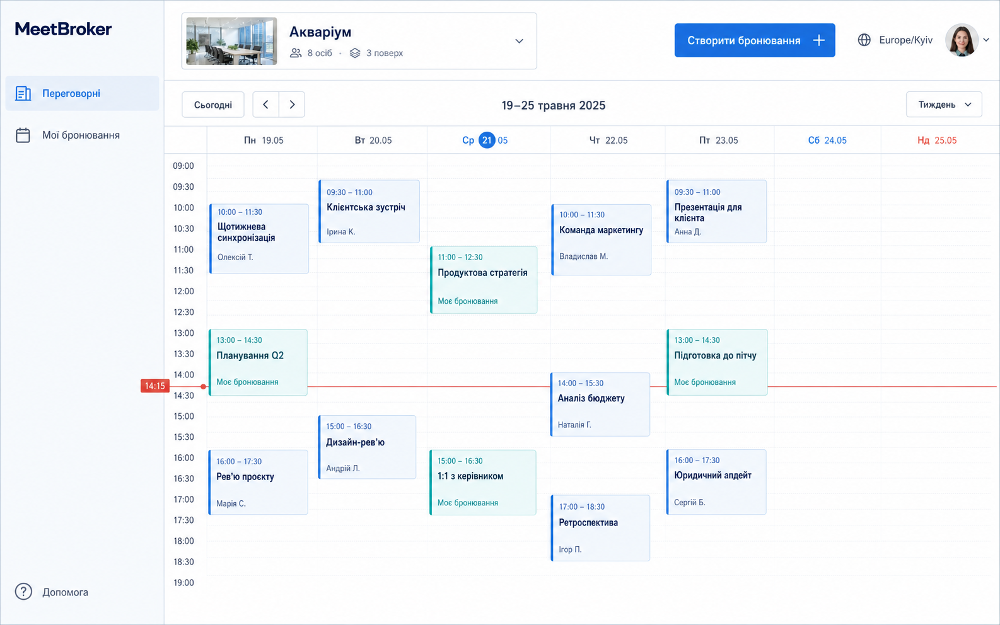
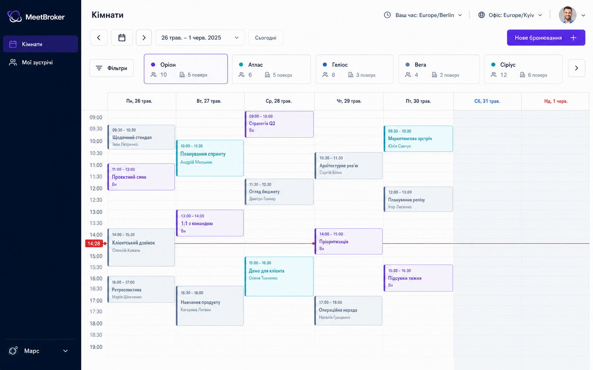
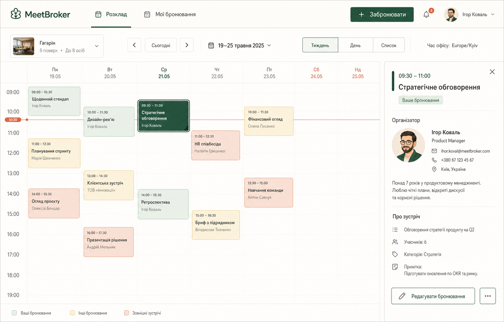
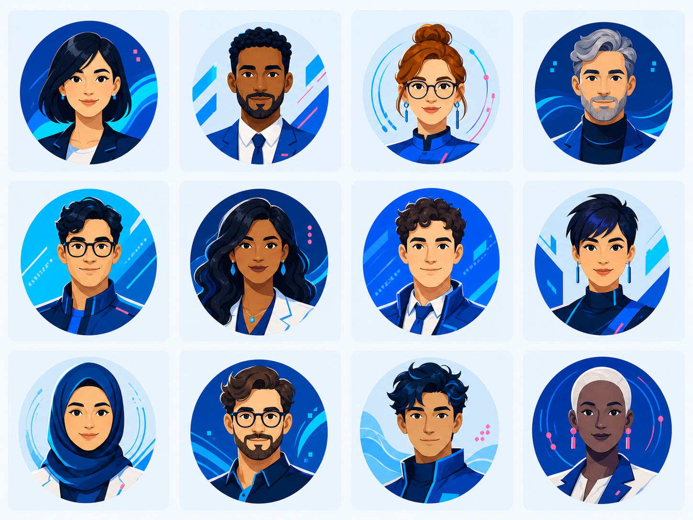

# Візуальні напрями MeetBroker

Концепти потрібні для вибору дизайн-системи. Вони не є точними макетами:
згенеровані назви, дати, фотографії та персональні дані не визначають
поведінку майбутнього продукту.

## A. Kyiv Light

Світлий корпоративний напрям із великою кількістю вільного простору.

### Характер

- спокійний і зрозумілий з першого погляду;
- біле та дуже світле блакитне тло;
- темно-синій текст;
- синій як основна дія;
- бірюзовий для власних бронювань;
- кораловий лише для попереджень і поточного часу.

### Сильні сторони

- найкраща читабельність щільної календарної сітки;
- добре підходить до конкурсного очікування акуратного Google Calendar-like
  інтерфейсу;
- легко реалізувати доступний контраст;
- нейтрально сприймається в різних корпоративних середовищах.

### Ризики

- без характерної типографіки та деталей може виглядати надто стандартно;
- фотографія кімнати в selector потребує окремих якісних assets або може бути
  замінена піктограмою.

## B. Orbit

Контрастний технологічний напрям із темною навігацією та компактним
розміщенням кімнат.

### Характер

- темно-синя навігація;
- світла робоча площина;
- фіолетова основна дія;
- cyan для додаткового виділення;
- більш щільний, інструментальний інтерфейс.

### Сильні сторони

- має найвиразнішу власну ідентичність;
- добре відділяє навігацію від календаря;
- зручний для швидкого перемикання між кімнатами;
- природно масштабується до розвиненої адмінки.

### Ризики

- потребує суворої дисципліни кольорів;
- темна панель займає більше візуальної уваги;
- на вузьких екранах ряд карток кімнат треба замінити компактним selector.

## C. Dobra

Теплий людяний напрям із профілями та деталями зустрічі як важливою частиною
досвіду.

### Характер

- тепле ivory-тло;
- темно-зелена основна дія;
- sage, amber і clay для календарних станів;
- редакційна типографіка й м'які форми;
- ілюстровані аватари замість обов'язкових фотографій.

### Сильні сторони

- найкраще підтримує профілі та готові аватари;
- не виглядає як типовий безликий dashboard;
- бічна картка добре пояснює контекст бронювання;
- тепла палітра зменшує відчуття складної корпоративної системи.

### Ризики

- слід уважно контролювати контраст теплих кольорів;
- постійна бічна панель зменшує календар;
- показ контактних даних із концепту не переноситься до продукту через
  приватність.

## Порівняння

| Критерій | Kyiv Light | Orbit | Dobra |
|---|---:|---:|---:|
| Читабельність календаря | 5/5 | 4/5 | 4/5 |
| Власна ідентичність | 3/5 | 5/5 | 5/5 |
| Простота реалізації | 5/5 | 4/5 | 4/5 |
| Підтримка профілів | 4/5 | 3/5 | 5/5 |
| Масштабування адмінки | 4/5 | 5/5 | 4/5 |
| Мобільна адаптація | 4/5 | 4/5 | 3/5 |

## Обраний напрям

Основою продукту обрано **Dobra**: тепла палітра, людяні профілі, редакційна
типографіка та картка деталей. Замість верхньої навігації концепту
використовується постійне ліве меню за структурою **Kyiv Light**.

Із **Orbit** можна запозичувати лише щільність адміністративних таблиць і
деякі патерни перемикання кімнат. Його фіолетово-cyan палітра не змішується з
Dobra.

Дизайн від початку будується на семантичних tokens, тому підтримує:

- світлу й темну тему без дублювання компонентів;
- логотип, назву й контрольований accent конкретної компанії;
- українську та наступні локалі без залежності від довжини підписів;
- єдину систему станів календаря в усіх брендованих варіантах.

## Концепт готових аватарів

Аркуш визначає стилістичний напрям: професійні, доброзичливі портрети, що
читаються у малому круглому crop. Після затвердження стилю фінальні аватари
генеруються або відмальовуються окремими квадратними файлами з однаковою
геометрією.
