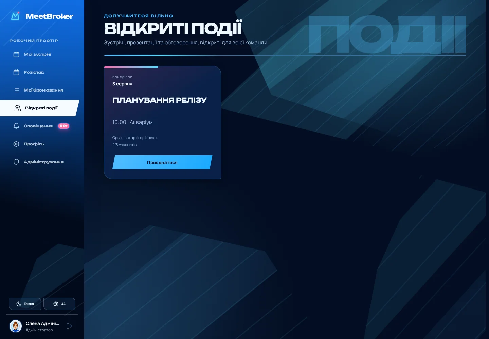

# Актуальна дизайн-система MeetBroker

Статус: **чинна**

Оновлено: 2026-07-31

MeetBroker використовує власну editorial-interface систему для корпоративного
планування. Ранні напрями Kyiv Light, Orbit і Dobra допомогли визначити
читабельність, структуру навігації та роль профілів, але більше не є
специфікацією готового продукту.

Чинний інтерфейс слід оцінювати за реальними екранами й правилами цього
документа.

## Візуальна ідея

Інтерфейс поєднує точність корпоративного інструмента з енергійною
редакційною композицією:

- глибокий navy визначає навігацію, рамки робочих сцен і темну тему;
- cobalt і cyan позначають головну дію, активний стан та рух;
- hot pink використовується дозовано для поточного часу, лічильників і
  термінових сигналів;
- ice-blue поверхні підтримують читабельність щільного календаря;
- Unbounded формує великі заголовки й технічні маркери, Manrope — основний
  текст та елементи керування.

Натхнення від Persona 3 Reload використане на рівні принципів — асиметрії,
типографічного ритму, спрямованих форм і відчуття руху. У продукті немає
скопійованих екранів, персонажів, логотипів або ігрових асетів.

## Композиція сторінки

Кожна основна сторінка складається з чотирьох шарів:

1. Постійна desktop-навігація або компактна mobile-навігація.
2. Повноширинний editorial-header із eyebrow, заголовком, описом і
   тематичним словом-маркером.
3. Робоча сцена з власним технічним підписом і зрізаними кутами.
4. Предметний контент: календар, agenda, список, картки або адміністративна
   форма.

Фонові слова не є випадковим декором. Вони швидко ідентифікують контекст:

| Розділ | Маркер |
|---|---|
| Мої зустрічі | `HOME`, у картці наступної зустрічі — `NEXT` |
| Розклад | `SCHEDULE` |
| Мої бронювання | `BOOKINGS` |
| Відкриті події | `EVENTS` |
| Сповіщення | `LOG` |
| Профіль | `PROFILE` |
| Адміністрування | `CONTROL` |

У світлій темі маркер є світло-блакитним і читається поверх декоративної
геометрії. У темній — напівпрозорим синім, достатньо світлим для впізнавання,
але слабшим за контент.

## Геометрична мова

- Основні, другорядні, ghost і danger-дії використовують спільний похилий
  силует.
- Активний пункт бокового меню має стрічкову форму, що візуально виходить за
  лівий край viewport.
- Великі робочі сцени можуть мати зрізані кути й технічну верхню смугу.
- Внутрішні таблиці та календарні комірки залишаються прямими: декоративний
  контур не повинен спотворювати точну сітку.
- Картки мають власну заливку та межу; контент не лежить безпосередньо на
  декоративному фоні.

Геометрія присутня вже в базовому стані. Hover змінює колір, світло й
невелике зміщення, не показуючи проміжний прямокутник.

## Теми й семантичні кольори

Світла й темна теми використовують ту саму компонентну структуру та
семантичні tokens:

- `surface`, `surface-raised`, `surface-muted`;
- `text`, `text-muted`, `border`;
- `primary`, `primary-contrast`;
- `booking-own`, `booking-other`, `booking-open`;
- `room-block`, `warning`, `danger`, `success`;
- окремі значення декоративного фону й page marker.

Брендовий accent не підміняє значення danger, success, недоступності або
поточного часу. Новий корпоративний бренд змінює tokens і логотип, а не
розмітку сторінок.

## Календар

Календар є найщільнішим екраном і задає дисципліну для решти продукту:

- режим «7 днів» показує канонічне семиденне вікно;
- режим «Авто» обчислює 2–7 колонок за фактичною шириною сцени;
- горизонтальна прокрутка не є основним способом мобільної адаптації;
- заголовки дня, шкала часу та комірки мають спільні лінії;
- неробочі дні, недоступність, власні, сторонні й відкриті зустрічі мають
  різну семантику;
- картка бронювання може використовувати завантажену обкладинку як
  приглушений фон, не втрачаючи контрасту тексту.

## Навігація й доступність

- Першим пунктом є «Мої зустрічі» як персональна домашня agenda.
- На desktop навігація постійна; на mobile основні розділи доступні в нижній
  панелі, а тема й мова — у верхньому utility-блоці.
- Усі інтерактивні елементи мають видимий `:focus-visible`.
- Tab проходить логічний DOM-порядок; стрілки використовують спільний
  spatial-navigation шар між меню, utility-контролами, формами й групами
  кнопок.
- Є skip-link до основного контенту, semantic landmarks, назви icon-only
  дій, `aria-current`, `aria-pressed`, стани помилок і `prefers-reduced-motion`.
- Модальні вікна та drawer монтуються portal-шарами й блокують та розмивають
  усю оболонку, включно з навігацією.

## Адаптивність

| Клас | Поведінка |
|---|---|
| Wide desktop | Повна бічна навігація, широкі editorial-сцени, 7 колонок календаря |
| Compact desktop | Збережена ієрархія, перенесення toolbar і стисліші робочі області |
| Tablet | Контентні сітки переходять у меншу кількість колонок, без page overflow |
| Mobile | Нижня навігація, вертикальні форми, Auto-календар щонайменше на 2 дні |

## Локалізація

Компоненти не містять користувацьких текстів як ідентифікаторів стану.
Підтримуються українська, англійська, німецька, іспанська, французька та
японська. Розкладки перевіряються з урахуванням різної довжини підписів;
дати, час і числа форматуються locale-aware API.

## Історія ранніх концептів

Початкові Kyiv Light, Orbit і Dobra збережені в
[архіві концептів](CONCEPT_ARCHIVE.md) як історія дослідження. Вони не
визначають актуальні кольори, компоненти або структуру сторінок.

Для нової роботи джерелами істини є:

1. цей документ;
2. [канонічні UI-компоненти](UI_COMPONENTS.md);
3. реальна компонентна реалізація й semantic tokens;
4. актуальні скріншоти, зняті з DEMO-стека.
